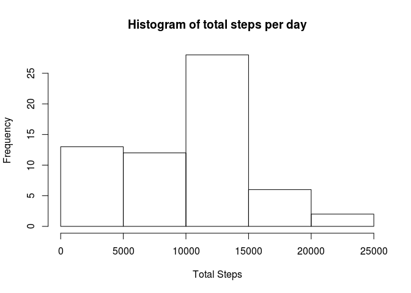
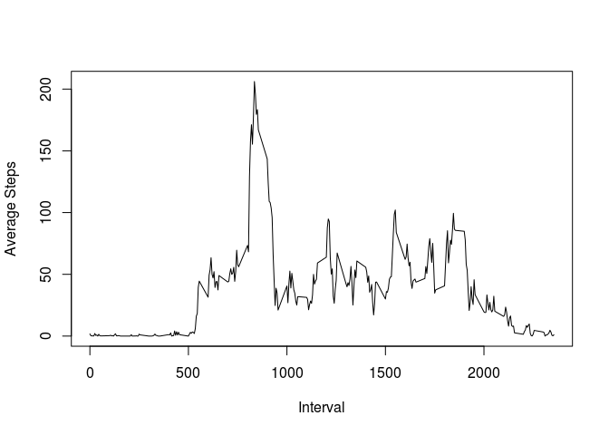
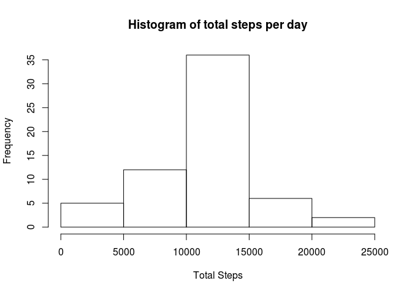
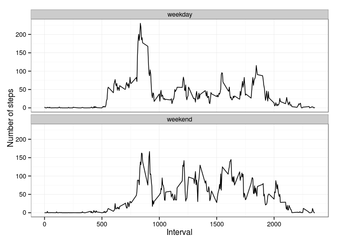

# Reproducible Research:Peer Assessment 1
treadrightly  
`r format(Sys.time(), '%d %B, %Y')`  
The following code block sets knitr options to ensure that the directory structure is correct when knitted through RStudio, and also defines package dependencies.  


```r
require(knitr)
```

```
## Loading required package: knitr
```

```r
require(ggplot2)
```

```
## Loading required package: ggplot2
```

```r
opts_chunk$set(echo = TRUE, fig.path = "figure/")
```

## Loading and preprocessing the data
Before executing the following steps, ensure that the working directory is set to the correct location containing [activity.zip](https://d396qusza40orc.cloudfront.net/repdata%2Fdata%2Factivity.zip).  


```r
unzip("activity.zip")
data <- read.csv("activity.csv", sep=",", colClasses=c("numeric", "character", "numeric"))
```


## What is mean total number of steps taken per day?
To determine the mean total number of steps taken per day, first compute the total number of steps per day by aggregating w.r.t "date".  
Datapoints with NA are removed during aggregation.


```r
totalStepsPerDay <- setNames(aggregate(data[, "steps"], by=list(data$date), FUN=sum, na.rm=TRUE), c("days", "totalSteps"))
hist(totalStepsPerDay[,"totalSteps"], main="Histogram of total steps per day", xlab="Total Steps")
```

 

Calculate the mean and median of the total number of steps taken per day:


```r
mean(totalStepsPerDay[, "totalSteps"])
```

```
## [1] 9354.23
```

```r
median(totalStepsPerDay[, "totalSteps"])
```

```
## [1] 10395
```

## What is the average daily activity pattern?
To determine the average daily activity pattern, we average the number of steps taken per interval, across all days. E.g., to calculate the average daily pattern for interval 24, we compute the average for the steps taken in interval 24 across all days.  
Datapoints with NA are removed during aggregation.


```r
averageStepsPerInterval <- setNames(aggregate(data[, "steps"], by=list(data[, "interval"]), FUN=mean, na.rm=TRUE), c("interval", "meanSteps"))
plot(averageStepsPerInterval$interval, averageStepsPerInterval$meanSteps, type="l", xlab="Interval", ylab="Average Steps")
```

 

The interval with the maximum number of steps is computed below:


```r
averageStepsPerInterval$interval[which.max(averageStepsPerInterval$meanSteps)]
```

```
## [1] 835
```

## Imputing missing values
The input csv contains missing values (as NA) for the number of steps. In this dataset, the number of missing values are:


```r
sum(is.na(data))
```

```
## [1] 2304
```

The missing data is now filled in using the following strategy: For each missing number of steps value, determine the interval it belongs to. Substitute the corresponding average steps per interval computed earlier. The new data frame so created no longer contains any NAs, they have been replaced with the average for the corresponding interval.


```r
revisedData <- data
for (i in 1:dim(revisedData)[1])
  {
    if (is.na(revisedData[i,"steps"]) == TRUE) 
      {
        missingInterval <- revisedData[i, "interval"]
        revisedData[i, "steps"] <- averageStepsPerInterval[which(averageStepsPerInterval$interval == missingInterval), "meanSteps"]
      }
  }
```

Summarize the number of steps taken per day for the revised data.


```r
totalStepsPerDayRevised <- setNames(aggregate(revisedData[, "steps"], by=list(revisedData[, "date"]), FUN=sum, na.rm=TRUE), c("days", "totalSteps"))
hist(totalStepsPerDayRevised[,"totalSteps"], main="Histogram of total steps per day", xlab="Total Steps")
```

 

Calculate the mean and median of the total number of steps taken per day for the revised data.


```r
mean(totalStepsPerDayRevised[, "totalSteps"], na.rm=TRUE)
```

```
## [1] 10766.19
```

```r
median(totalStepsPerDayRevised[, "totalSteps"], na.rm=TRUE)
```

```
## [1] 10766.19
```

As can be observed, the mean and median of the total number of steps taken per day has changed after imputing data. At the time of document creation, these values increased after imputing data when compared to the values calculated after dropping missing data. Note that results may vary depending on the contents of activity.csv.  

Thus, imputing missing data has the effect of changing the data, and therefore the results.  

## Are there differences in activity patterns between weekdays and weekends?

To detect differences in activity patterns between weekdays and weekends over the revised data, create a new factor variable called "day" with two levels - "weekday" and "weekend". The value of the "day" variable is computed by converting the date to a POSIXt object, and then calling the weekdays() method. The activity patterns for weekdays and weekends are computed by aggregating over the revised data w.r.t day and interval. 


```r
for (i in 1:dim(revisedData)[1])
  {
    day <- weekdays(strptime(revisedData$date[i], format="%Y-%m-%d"))
    if (day %in% c("Monday", "Tuesday", "Wednesday", "Thursday", "Friday"))
      revisedData$day[i] = "weekday"
    else
      revisedData$day[i] = "weekend"
  }
averageStepsPerIntervalRevised <- setNames(aggregate(revisedData$steps, by=list(revisedData$day, revisedData$interval), FUN=mean), c("day", "interval", "steps"))
averageStepsPerIntervalRevised$day <- as.factor(averageStepsPerIntervalRevised$day)
g <- qplot(data=averageStepsPerIntervalRevised, x=interval, y=steps, geom="line", xlab="Interval", ylab="Number of steps") + facet_wrap(~day, ncol=1) + theme_bw()
print(g)
```

 
